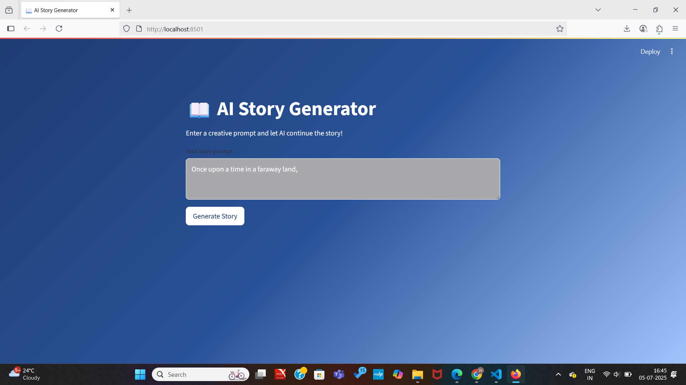
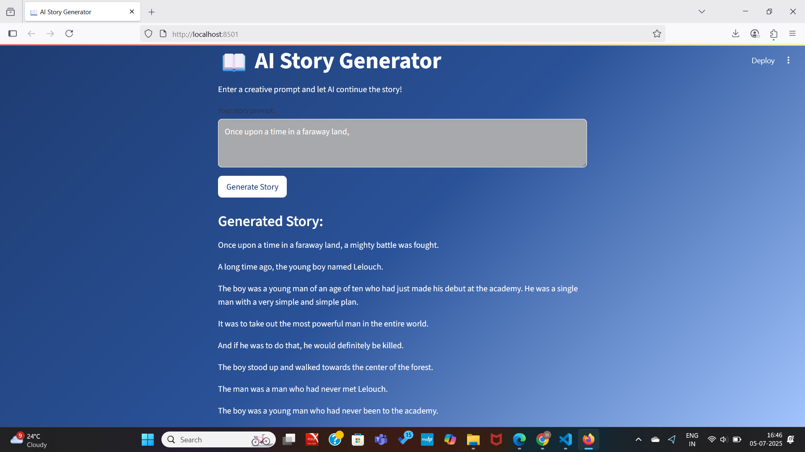
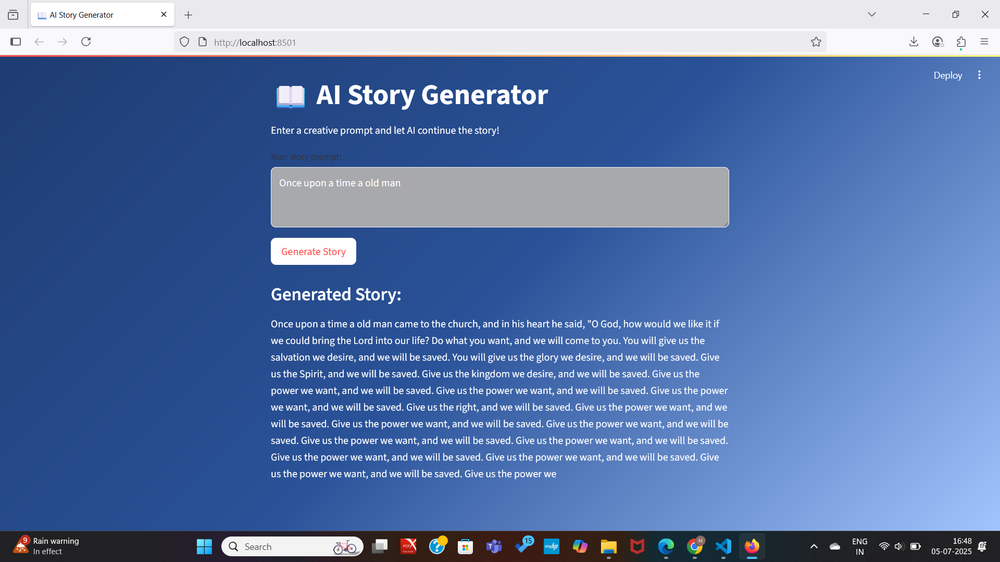

# 📖 AI Story Generator

A simple, beautiful Streamlit web app that lets you enter a creative prompt and watch AI continue the story!  
Built using Python, Streamlit, and the Hugging Face Transformers library (GPT-2).

---

## ✨ **Features**
✅ Clean & modern UI with gradient background and custom styling  
✅ Text input to enter your story prompt  
✅ “Generate Story” button to see AI-powered continuation  
✅ Shows generated story instantly on the same page

---

## 🛠 Project Overview
This project guides you through:
- Setting up Python and virtual environment
- Writing a Streamlit app (`app.py`)
- Installing required libraries
- Running the app locally

---

## 📂 Folder Structure
```text
AI_Story_Generator/
├── app.py
├── requirements.txt
├── screenshots/
│   ├── home_screen.png
│   ├── output_1story.png
│   ├── output_2story.png
│   ├── output_3story.png
└── README.md

## ✅ **Installation & Setup**

1️⃣ **Install Python** (if not installed)  
👉 [Download Python](https://www.python.org/downloads/)  
While installing, check ✅ “Add Python to PATH”

2️⃣ **Clone this repository** or download ZIP and extract

3️⃣ **Open folder in VS Code**  
```bash
cd AI_Story_Generator
```
4️⃣ Set up virtual environment (recommended)
python -m venv venv
✅ Activate it:

For Windows:
venv\Scripts\activate

For Mac/Linux:
source venv/bin/activate

5️⃣ Install required libraries

pip install -r requirements.txt

▶ **Run the App**

In VS Code terminal or command prompt:

streamlit run app.py

**Sample Prompts**

Try these in the app:

“In a hidden valley where dragons once ruled, a young shepherd discovers an ancient egg.”

“A historian accidentally travels back to ancient Egypt and must blend in to survive.”

“Every morning, Lily receives an anonymous letter that hints at secrets from her past.”


📸** Screenshots**
### 🔹 Home Screen  


### 🔹 Output Story (Default)


### 🔹 Output Story 1  


### 🔹 Output Story 2  


### 🔹 Output Story 3  


## ⚙ Tech Used
- Python
- Streamlit
- Hugging Face Transformers (GPT-2)
